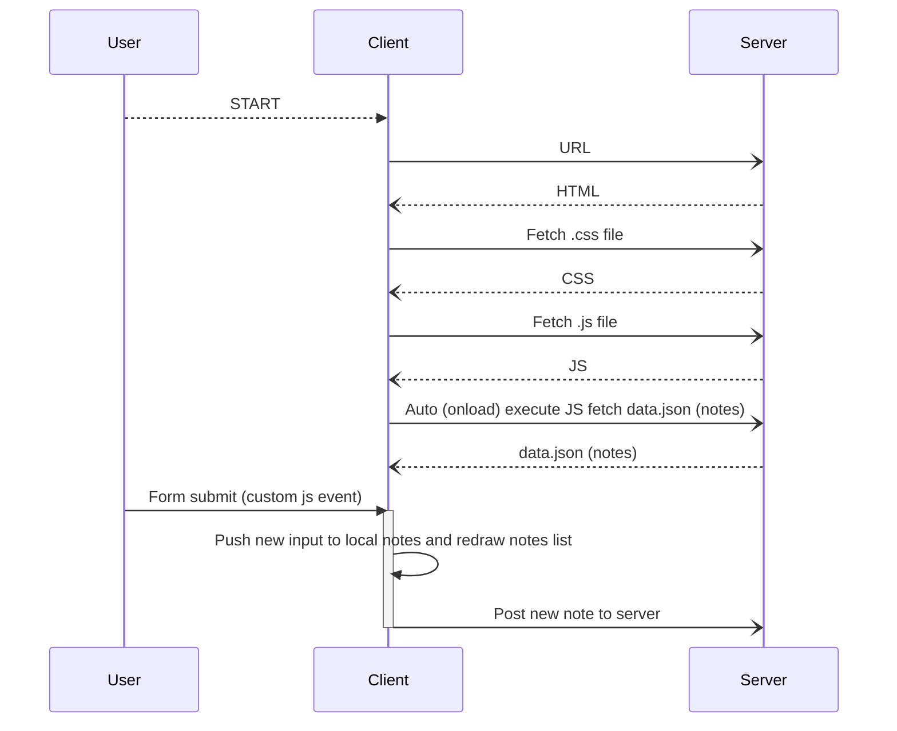

# Online course from Helsinki University
https://fullstackopen.com/en/
## Part 0
### Exercise 4, 5 & 6:

```mermaid
sequenceDiagram
    User-->>Client: START
    Client-) Server: URL
    Server--) Client: HTML
    Client-) Server: Fetch .css file
    Server--) Client: CSS
    Client-) Server: Fetch .js file
    Server--) Client: JS
    Client-) Server: Auto (onload) execute JS fetch data.json (notes)
    Server--) Client: data.json (notes)
    User ->> Client: Form submit (custom js event)
    activate Client
    Client ->> Client: Push new input to local notes and redraw notes list
    Client -) Server: Post new note to server
    deactivate Client
```
